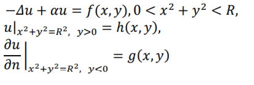
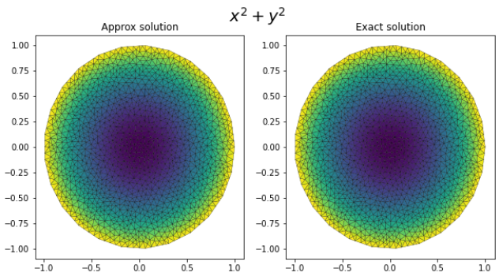
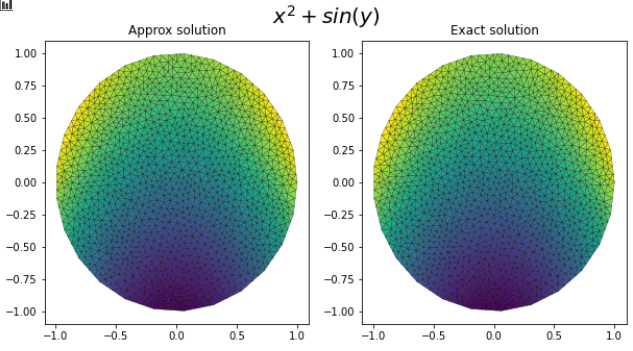
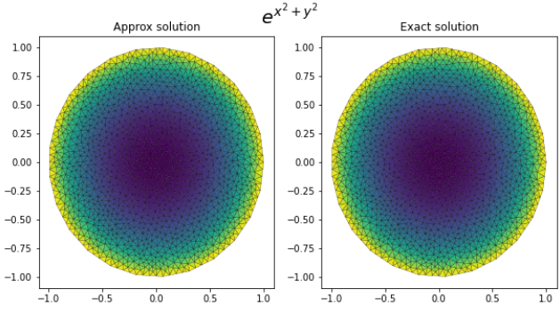
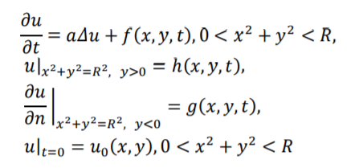
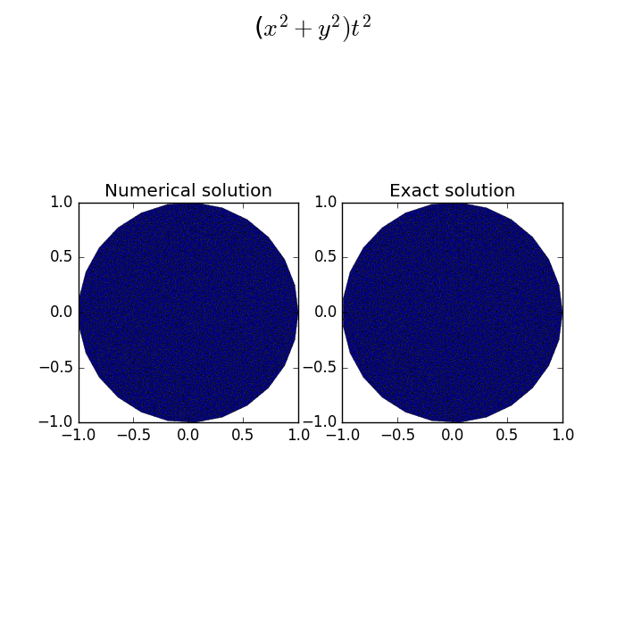
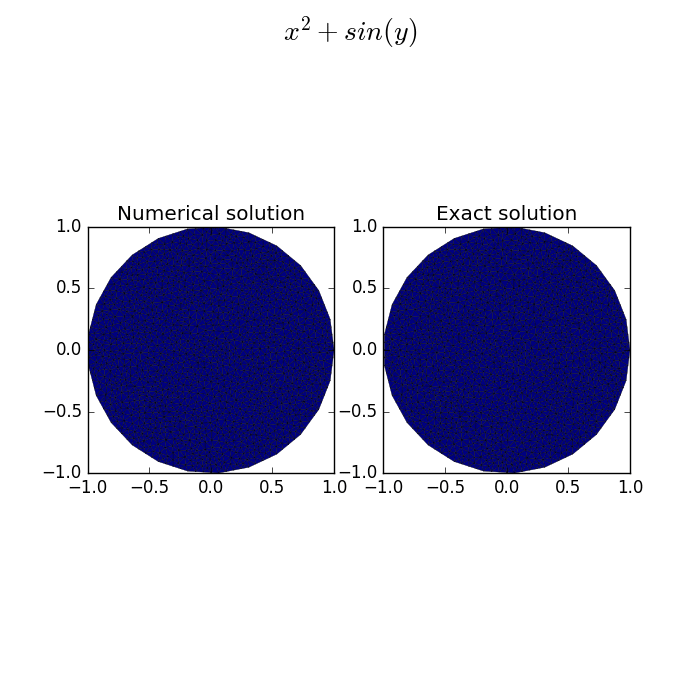
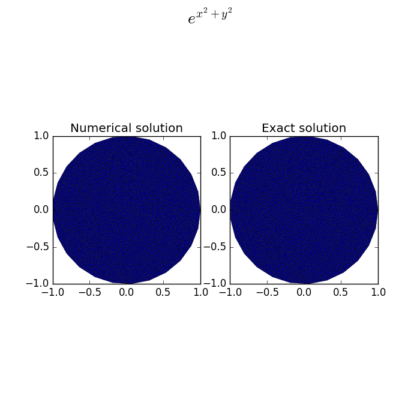

Solving partial differential equations using fenics
===

Implementation of the solution of two types of partial differential equations

## Boundary problem

Problem:

Results:

## Heat conduction problem:

Results:

Error plots in test.ipynb

Implemetation:
------------
* test.ipynb - main notebook with all results
* PlotSolutions.py - class that consists all function for plot results
* BoundaryProblem.py - implementation of solving boundary problem 
* HeatProblem.py - implementation of solving heat conduction problem 