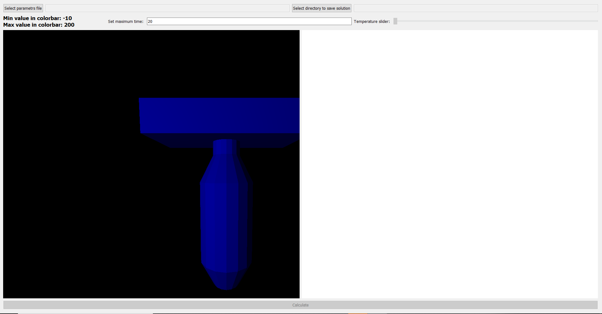

Calculation and visualization of the thermal regime of the spacecraft
=====================================================================

Description:
------------

There is UI for calculation and visualization of the thermal regime of the spacecraft.

UI example:


Run:
----
To run programm:
```
        python spacecraft.py    
```

UI description:
------------
After run start script there is UI like this:



First of all, you need to select the csv file with parameters and save directory. After that the calculation button is unlocked.

**To see the change in temperature on the model, use the slider.**

Implemetation:
------------
* spacecraft.py - start script
* UI_MainWindow.py - run all UI widgets
* HeatBalanceSolver.py - solver class for heat balance equation. Contains main solving function and saving solution in csv file.
* ModelParser.py - contains reader for obj file and  areas calculation.
* GL_Widget.py - implemetation of visualization model in OpenGL

Requirements:
------------
* numpy
* scipy 
* PyQT5
* PyOpengl
* pandas
* matplotlib


