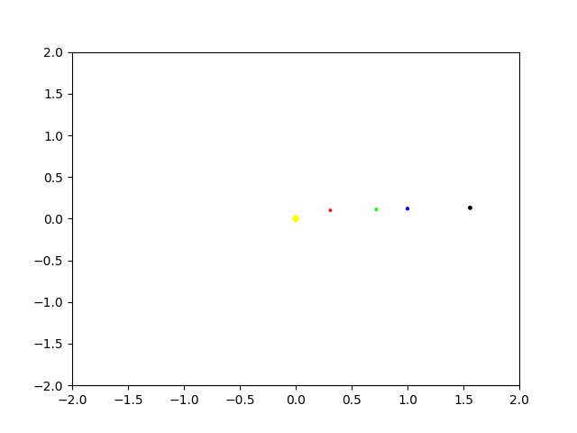
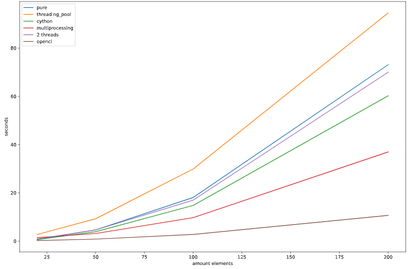

Gravitational problem of N-body
=====================================================================

Description:
------------
This repository contains the implementation of the solution to the N-body problem. This problem was solved by the verlet method. There are also various techniques to speed up the method.
Speed up techniques:
* Threadings 
* Multiprocessing
* Cython
* OpenCL

Results
------
### Work of the verlet method on the example of the planets of the solar system

  
### Comparison of the running times of different acceleration techniques

Implemetation:
------------
* results.ipynb - main notebook with all results
* gravitationalSolver.py - class that consists all function for solve problem
* verlet_cl.py - implementation of verlet method in OpenCL 
* create_gif.py - script for creating gif images of the motion of the planets of the solar system. Movement obtained by verlet method
* cython_solve.pyx - implemetation of verlet method in Cython
* AnimatedScatter.py - the class that animates the scatter

